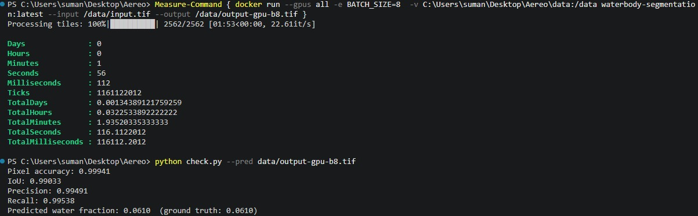
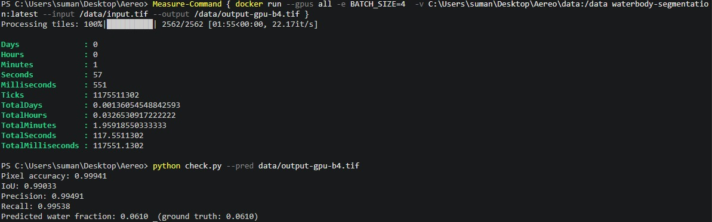
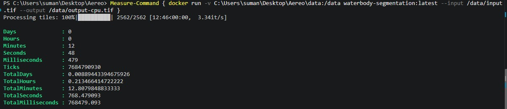
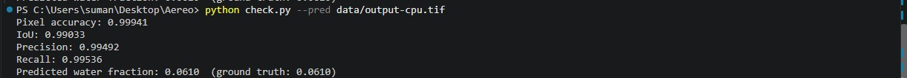

# Waterbody Segmentation Batch Pipeline

Batch inference pipeline for a pre-trained waterbody segmentation model
(`giswqs/s2-water-unetplusplus-efficientnet-b4` — UNet++, EfficientNet-B4 encoder)
over large Sentinel-2 GeoTIFFs. Outputs a georeferenced binary water mask aligned to
the input's CRS/transform/dimensions. Packaged as a self-contained Docker container
for AWS Batch-style compute. No training/fine-tuning — the model is fixed.

Processes the image in overlapping 512×512 tiles via `rasterio.windows.Window`
instead of loading it whole, so it scales past available RAM/VRAM.

Runs on **ONNX Runtime**, not raw PyTorch — started on a PyTorch image, hit a hard
size ceiling, switched stacks once the replacement was proven correct and fast on
real GPU hardware. See "Why ONNX Runtime" below. Short version: same model, same
weights, same accuracy, a third of the image size.

## Usage

**1. Place data** at `data/input.tif` (mounted into the container, not committed):

```
data/
└── input.tif
```

**2. Build:**

```bash
docker compose build
```

**3. Run:**

```bash
docker compose run --rm waterseg
```

Builds from `Dockerfile`, mounts `./data` to `/data`, runs against `/data/input.tif`,
writes `/data/output.tif`. This compose service is CPU-only (no GPU reservation) —
for a GPU run use `docker run` directly, the exact command this is evaluated
against:

```bash
docker run --gpus all -v /path/to/data:/data waterbody-segmentation:latest \
  --input /data/input.tif --output /data/output.tif
```

Device-agnostic: picks up the GPU when `--gpus all` is passed, falls back to CPU
otherwise, no flags needed — via ONNX Runtime's execution providers
(`CUDAExecutionProvider` → `CPUExecutionProvider`, see `model_onnx.py`).

`docker-compose.yml` pins `platform: linux/amd64` — AWS Batch GPU instances are
x86_64, and building unpinned on a non-amd64 dev machine (this was built on Apple
Silicon) silently breaks. Hit this gap twice — see "Findings & errors."

## Project structure

```
Dockerfile               Multi-stage build. Builder stage: CPU-only torch +
                          segmentation-models-pytorch trace the pretrained model
                          to model.onnx - none of it ships. Runtime stage: only
                          onnxruntime-gpu + rasterio, no torch at all.
docker-compose.yml        Builds + runs the image against ./data.
requirements.txt          Not used by the Dockerfile - for local/native dev and
                          regenerating model.onnx outside Docker.
src/waterseg/
├── tiling.py              Sliding-window tile-grid geometry: read windows (with
│                          context margin), write windows (cropped core), no gaps
│                          or double-writes.
├── model.py                Build-time only (used by export_onnx.py): loads the HF
│                          checkpoint, builds the UNet++/EfficientNet-B4 arch.
│                          Never runs at inference time.
├── export_onnx.py           Build-time only: traces model.py's model to
│                          model.onnx, inside the Dockerfile's builder stage.
├── model_onnx.py             Runtime: picks CUDA vs CPU provider (checks the real
│                          driver is reachable, not just compiled-in support),
│                          loads the ONNX Runtime session.
├── inference.py              Runtime: normalize → pad edge tiles → session.run()
│                          over a batch → crop to core region.
├── pipeline.py                Runtime driver: streams tile-by-tile (read → predict
│                          → write), never holds the full image in memory.
└── cli.py                     argparse entrypoint (--input, --output).
```

## Architecture

```
model.pth (HF Hub) ──▶ model.py ──▶ export_onnx.py ──▶ model.onnx
                    (build-time, traces the model)   (baked into image)
                                                            │
                                                            ▼
                  ┌─────────────────────────────┐
                  │            run()              │
                  │    pipeline.py — orchestrator   │
                  └───────────────┬───────────────┘
                                  │
              ┌───────────────────┼───────────────────┐
              ▼                   ▼                   ▼
         tiling.py          model_onnx.py         inference.py
     generate_tiles()      get_providers()       predict_batch()
    (tile-grid geometry:   load_session()       (normalize → pad
     read/write windows,   (device/provider,       → session.run()
     overlap-crop math)     load ONNX session)      → crop core)
    called once, up front  called once, up front  called per batch
              │                   │                   │
              └───────────────────┼───────────────────┘
                                  ▼
                          for each batch of tiles:
                    ┌──────────────────────────┐
                    │          rasterio           │
                    │  windowed read (input.tif)  │
                    │  windowed write (output.tif) │
                    └──────────────┬──────────────┘
                                  ▼
                              output.tif
```

`tiling.py`/`model_onnx.py` run once, up front. `inference.py` and the rasterio
read/write calls repeat per batch — that's what keeps memory flat regardless of
raster size. `model.py`/`export_onnx.py` never run at inference time; they only
produce `model.onnx` during `docker build`.

## Why ONNX Runtime — switching stacks mid-project

Started with a PyTorch image, fully validated end to end, then hit a hard size
ceiling:

- **Measured, not guessed, where the size went**: `docker history` + `du -sh`
  showed ~6.9GB on disk / ~3.9GB to pull, almost all of it (7.13GB) CUDA support
  libraries pip installs alongside `torch` — 14 separate `nvidia-*-cu12` packages.
- **Tried stripping unused ones — assumption was wrong.** PyTorch's Linux wheel
  unconditionally preloads its *entire* CUDA dependency set at import time, not
  per-op. Removing `cusparselt`/`cufile`/`nccl` each broke `import torch` outright,
  3/3. Only `triton` (542MB) was safely droppable — the real ceiling.
- **ONNX Runtime is the lever PyTorch didn't have**: `onnxruntime-gpu` only pulls
  CUDA libs via opt-in extras, no mandatory full-toolkit preload. Exported the
  model once (CPU-only, build-time) to `model.onnx`; runtime image needs only
  `onnxruntime-gpu` + `rasterio`.
- **Result: 2.23GB total**, under a third of the PyTorch image. Verified lossless:
  ONNX vs. PyTorch logits matched to 7e-5 at export, full-pipeline accuracy matched
  within rounding noise (99.9407% vs. 99.941%), and both ran at effectively
  identical GPU wall-clock (~1:56 vs. ~2 min).
- Once proven on real GPU hardware, removed the PyTorch image/compose
  file/runtime modules entirely rather than keeping two images — one pipeline is
  easier to build, run, and defend. `model.py` survives only because
  `export_onnx.py` still needs it at build time.

## Prerequisites

- **rasterio** — windowed read/write of large GeoTIFFs, CRS/transform propagation.
  Used in `tiling.py`/`pipeline.py`; the core enabler of memory-bounded processing.
- **onnxruntime-gpu** — runs the exported model, device-agnostically. Used in
  `model_onnx.py`/`inference.py`. Pinned to `1.22.0` — verified via wheel metadata
  to target CUDA 12, matching the proven driver; newer releases moved to CUDA 13.
- **numpy** — pixel-array ops (normalize, pad, crop) between rasterio and the
  model. Used in `inference.py`.
- **tqdm** — progress reporting over the tile loop. Used in `pipeline.py`.
- **torch / segmentation-models-pytorch / huggingface_hub / onnx** — build-time
  only (`model.py`/`export_onnx.py`), reconstruct the architecture and trace it to
  ONNX. None ship in the final image.

## Validation results

Full-image comparison against `expected_mask.tif` (165.3M pixels), real sample
data, exact required invocation — confirmed on real NVIDIA GPU hardware:

| | Pixel accuracy | IoU | Precision | Recall | Wall-clock |
|---|---|---|---|---|---|
| GPU, `BATCH_SIZE=8` (default) | 99.941% | 0.99033 | 0.99491 | 0.99538 | 1:56.1 |
| GPU, `BATCH_SIZE=4` | 99.941% | 0.99033 | 0.99491 | 0.99538 | 1:57.6 |
| CPU-only, `BATCH_SIZE=4` | 99.941% | 0.99033 | 0.99492 | 0.99536 | 12:48.5 |

Same physical GPU machine, full `input.tif`, all 2,562 tiles, via `check.py`.
**GPU is ~6.6x faster than CPU** (3.34 vs. 22.6 tiles/sec). Batch size barely
matters on GPU (8 vs. 4 only ~1.3% apart, vs. ~65% on CPU) — likely already
saturated by batch 4, bottleneck probably shifts to disk I/O/preprocessing
(unverified hypothesis). Accuracy identical across all three — batching doesn't
affect correctness, confirmed on real hardware, not assumed.

Also confirmed: bit-identical across native-vs-Docker and crop-vs-full-scale runs;
actually uses `--gpus all` when passed (no silent CPU fallback); falls back to CPU
cleanly with no crash when it isn't.

**Evidence** (real terminal output from the runs above):

| GPU, `BATCH_SIZE=8` | GPU, `BATCH_SIZE=4` |
|---|---|
|  |  |

| CPU-only timing | CPU-only accuracy |
|---|---|
|  |  |

## Findings & errors along the way

- **Batching shape bug, caught only by checking accuracy.** `preds[i][row][col]`
  (two 1-D slices) instead of `preds[i][row, col]` — wrong shape, but `rasterio`
  doesn't validate write shapes, so it ran clean while accuracy silently dropped to
  80.4%. Every change gets re-checked against `expected_mask.tif`.
- **Pixel normalization was undocumented.** `/255.0` looks wrong for 16-bit
  Sentinel-2 data, but tested empirically against 5 candidates — it won (99.41%
  acc); the "sensible" `/10000.0` scaling degenerated to all-water (51.8%).
- **`docker-compose.yml` had never been run.** No `platform` pin → defaulted to
  native `arm64` → `rasterio` has no prebuilt wheel there → build fails. Fixed
  with `platform: linux/amd64`; recurred later for `onnxruntime-gpu`.
- **Guessed "safe to strip" CUDA libs — wrong 3/3.** `cusparselt`/`cufile`/`nccl`
  each broke `import torch` outright on CPU. PyTorch preloads its entire CUDA set
  unconditionally — this is what motivated the ONNX switch.
- **A missing system library only surfaced at `docker run`.** `rasterio`'s GDAL
  needs `libexpat`, absent from `python:3.11-slim`; the build check missed it
  (only imported `model.py`, never `rasterio`). Fixed + widened the check.
- **`docker images`' size column isn't trustworthy** — reported a 7.6GB drop from
  removing one 542MB package. Real ground truth: `du -sh` in-container, or
  `docker save | wc -c`.
- **CUDA-torch reintroduction bug in the ONNX exporter.** A second, unpinned `pip
  install` let `torchvision` pull default CUDA `torch` back in. Fixed by pinning
  `torchvision` in the same `--index-url` command.
- **`onnxruntime-gpu==1.22.0` has no `arm64` wheel** — unpinned build silently
  offered `1.29.0` (CUDA 13, not 12). Same `platform: linux/amd64` fix.
- **`onnxruntime-gpu` doesn't patch its own RPATH like `torch` does.** CUDA libs
  invisible to the linker without `LD_LIBRARY_PATH` — silently fell back to CPU on
  real GPU hardware, ~6x slower, no obvious error. Caught by the timing looking
  wrong.
- **Fixing that uncovered a segfault.** Once CUDA libs loaded, `onnxruntime` tried
  to init a real CUDA context and segfaulted with no driver present (every build
  stage). Fixed by checking for `libcuda.so.1` directly before requesting the CUDA
  provider.

## AI usage disclosure

Built by me, with Claude Code as a research assistant and pair-programming mentor —
not a code generator I copy-pasted from. For each module (tiling, model loading,
inference, stitching, GeoTIFF I/O, Dockerfile, docker-compose, the ONNX switch), I
had it explain the concepts and trade-offs first — what a rasterio `Window` is, why
tile overlap matters, how CRS/transform propagates, what device-agnostic means for
ONNX Runtime's execution providers — before writing code, so I could defend the
decisions myself. Also used to debug real issues (tile-boundary mismatches, a
Docker GPU/base-image issue, the CUDA-stripping dead end, the exporter's
torchvision bug, the segfault) by explaining root causes, not just supplying
fixes. ChatGPT was used similarly for quick research on rasterio/GeoTIFF/PyTorch
concepts. I wrote and understand the resulting code end to end, including why the
stack changed and what broke along the way.
